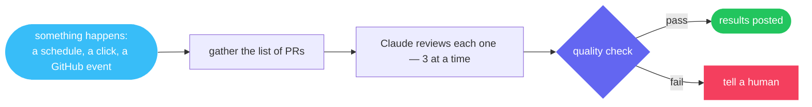

<div align="center">


<br/>

**Give AI real work. Keep real control.**

<br/>


</div>

---

## What is skyway?

skyway is a program you run on your own computer that turns [Claude](https://claude.com/claude-code) into a dependable worker. You describe a job once — *when a bug report comes in, investigate it and propose a fix* — and skyway handles the rest: it wakes up at the right moment, does the work step by step, stays inside its budget, asks a human before doing anything risky, and writes down everything it did.

Each job lives in a single text file. Not settings scattered across a dashboard, not a black box — one file that answers, at a glance, the three questions you should ask of any AI acting on your behalf:

> **What will it do? What did it do? What did it cost?**

## The rules it never breaks

skyway is built around a short list of principles, and two of them tell you most of what you need to know:

- 💸 *"Cost is a parse-time input, not a bill you discover at month end."* — every job carries a spending cap, and skyway refuses to start a step that would blow it. Not warns. Refuses.
- 🧾 *"'Unknown error' is a bug, not an outcome."* — when something fails, you get a precise, coded reason. Every step of every run is kept: what ran, what it said, what it cost.

And the quieter ones do the rest: risky steps wait for a human decision (and keep waiting, even across restarts). Secrets are masked before they can reach a log. Dangerous patterns are rejected when the file is checked — before anything runs — with no override switch to talk skyway out of it.

## See one

A job that reviews every open pull request, three at a time, with a quality check before anything is posted:



```
§scan§
bash = "gh pr list --json number --jq '[.[].number]'"
§§

§review§
depends_on = ["scan"]
foreach.items = "$scan.output"
foreach.max_concurrency = 3
§§

∆review∆
Review PR {{item}} ({{item_index}}/{{item_total}}). Post findings as a comment.
∆∆
```

That's the entire automation. The strange brackets are deliberate: these files are *written by AI and reviewed by humans* — skyway will even draft one for you from a plain-English sentence (`skyway compose`) and check it against 90+ safety and correctness rules before it can run.

## What people run on it

Jobs from the [essential-workflows](https://github.com/skyway-harness-builder/essential-workflows) library, ready to install:

- 🩺 **Health check** — probe your whole setup (logins, connections, missing secrets) and report red/green before anything breaks at 2am.
- 📝 **Release notes** — when you publish a release, draft human-readable notes from everything that changed, for you to approve.
- 🔍 **Failure triage** — when a job fails, a second job reads the logs, names the failing step, and proposes the fix.
- 📚 **Library upkeep** — audit, document, and diagram your whole collection of jobs, on a schedule.

## 🧭 Explore

| | |
|---|---|
| 📚 **[essential-workflows](https://github.com/skyway-harness-builder/essential-workflows)** | The curated first-party job library — essentials only, nothing padded. |
| 🐛 **[issues](https://github.com/skyway-harness-builder/issues)** | Something broken or missing? Tell us here. |
| ✅ **[lint-action](https://github.com/skyway-harness-builder/lint-action)** | Check workflow files automatically on every change, right in GitHub. |

**TL;DR** — one program on your own machine. Describe a job in one readable file, and skyway runs it with Claude: on schedule, on budget, with a human in the loop for anything risky, and a full record of every run.

<br/>

<div align="center">

Built by **[Skylence](https://skylence.be)**

</div>
