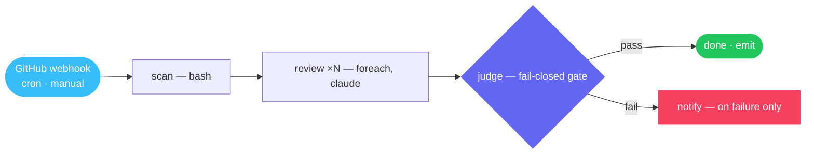

<div align="center">


<br/>

**Durable, reviewable AI agent workflows — from a single text file.**

<br/>


</div>

---

A `.sky` file is a whole automation you can read in one sitting: the trigger, the DAG, every prompt, every budget. skyway's daemon runs it — Claude sessions, bash, scripts, HTTP calls, approval gates — streams each step live over WebSocket, and keeps the full run history queryable.


    style F fill:#f43f5e,color:#fff,stroke:none
    style J fill:#6366f1,color:#fff,stroke:none
```

…and the file that runs it:

```
§scan§
bash = "gh pr list --json number --jq '[.[].number]'"
§§

§review§
depends_on = ["scan"]
foreach.items = "$scan.output"
foreach.max_concurrency = 3
§§

∆review∆
Review PR {{item}} ({{item_index}}/{{item_total}}). Post findings as a comment.
∆∆
```

Written by LLMs, for LLMs — reviewed by humans.

<br/>

## 🧭 Explore

| | |
|---|---|
| 📚 **[essential-workflows](https://github.com/skyway-harness-builder/essential-workflows)** | The curated first-party library — essentials only. Embedded in every binary, installable via `skyway library`. |
| 🐛 **[issues](https://github.com/skyway-harness-builder/issues)** | Bug reports and feature requests. Tell us what broke or what's missing. |

## ⚡ Why skyway

- 📝 **Workflows as text** — one reviewable file per automation; diff it, lint it, version it.
- 🛡️ **Fail-closed by design** — judge → sentinel → deterministic gates, per-node USD budgets, per-dependency circuit breakers, secrets scrubbed at the log boundary.
- 🔁 **A quality flywheel** — `skyway lint` (SKY-WF-\* codes) · `skyway eval` (outcome scoreboard) · `skyway optimize` (prompt-variant search).
- 📦 **Runs anywhere** — one Go binary, SQLite state, no external services. Dashboard optional.

<br/>

<div align="center">

Built by **[Skylence](https://skylence.be)**

</div>
