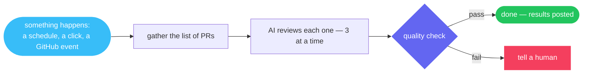

<div align="center">


<br/>

**Put repetitive work on autopilot — with AI you can read, review, and trust.**

<br/>


</div>

---

## What is skyway?

skyway runs **workflows**: step-by-step jobs where an AI does the actual work — reviewing a code change, drafting release notes, checking that a system is healthy, triaging a bug report. Each workflow lives in one plain text file that anyone can open and read: what triggers it, what happens at each step, and how much it's allowed to spend.

That last part matters. AI that acts on your behalf shouldn't be a black box. With skyway you can always answer three questions: *what will it do, what did it do, and what did it cost?*

- 🔍 **You can read it.** The whole job is one file — no hidden logic, no settings buried in a dashboard.
- 🛑 **It's careful.** Spending caps on every step, approval gates for anything risky, and it stops (rather than guesses) when a check fails.
- 🧾 **It keeps receipts.** Every run is recorded: each step, its output, its cost. Watch it live or look it up later.
- 🏠 **It runs on your machines.** One program to install. No servers, no accounts, no data leaving your control except the AI calls themselves.

## See one

Here's a workflow that reviews every open pull request — the picture and the actual file that runs it:



```
§scan§
bash = "gh pr list --json number --jq '[.[].number]'"
§§

§review§
depends_on = ["scan"]
foreach.items = "$scan.output"
foreach.max_concurrency = 3
§§

∆review∆
Review PR {{item}} ({{item_index}}/{{item_total}}). Post findings as a comment.
∆∆
```

Fifteen lines. That's the entire automation — and your team can review it like any other document.

## 🧭 Explore

| | |
|---|---|
| 📚 **[essential-workflows](https://github.com/skyway-harness-builder/essential-workflows)** | Ready-made workflows, curated to the essentials. Included with skyway, or install just the ones you want. |
| 🐛 **[issues](https://github.com/skyway-harness-builder/issues)** | Something broken or missing? Tell us here. |

<details>
<summary><strong>⚙️ For the engineers</strong></summary>
<br/>

`.sky` workflows are DAGs of nodes — Claude sessions, bash, scripts, HTTP calls, approval gates — with GitHub/cron/manual triggers, per-node USD budgets and retries, `foreach` fan-out with concurrency caps, and fail-closed judge→gate patterns. The Go daemon streams every step over WebSocket, scrubs secrets at the log boundary, trips per-dependency circuit breakers, and persists runs in SQLite. Quality tooling ships in the binary: `skyway lint` (SKY-WF-\* codes), `skyway eval` (outcome scoreboard), `skyway optimize` (prompt-variant search).

</details>

<br/>

<div align="center">

Built by **[Skylence](https://skylence.be)**

</div>
